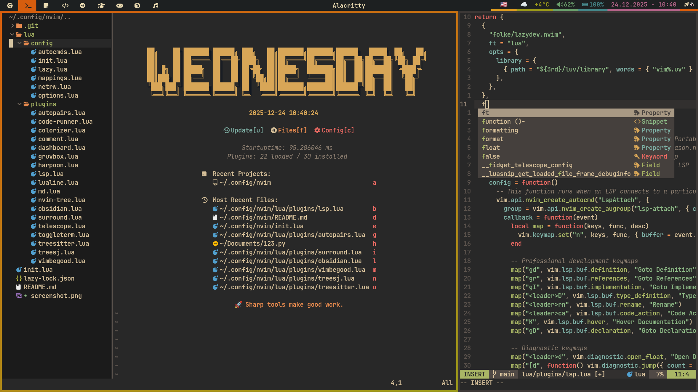

# 🌌 Ampersand's Neovim Configuration (2025 Edition)

Welcome to my personal Neovim setup. This configuration is built for speed, aesthetics, and professional development across multiple languages. Powered by **Lazy.nvim**, it features a modular structure, advanced LSP capabilities, and a refined user experience.

## 🛠️ Core Mappings

Defined in `lua/config/mappings.lua`, these are the global shortcuts that drive the editor's basic behavior.

| Key | Description | Mode |
|-----|-------------|------|
| `<leader>l` | Open Lazy.nvim Dashboard | Normal |
| `<leader>d` | Delete to void register (no clipboard overwrite) | Normal/Visual |
| `<leader>s` | Substitute word under cursor project-wide | Normal |
| `<leader>cs` | Clear search highlights | Normal |
| `gn` / `gp` | Next / Previous Buffer | Normal |
| `gd` | Delete Current Buffer | Normal |
| `J` | Join line with next (keeps cursor position) | Normal |
| `J` / `K` | Move selected lines Up / Down | Visual |
| `<C-d>` / `<C-u>` | Smooth scroll Down / Up (centered) | Normal |
| `n` / `N` | Next / Previous search match (centered) | Normal |
| `==` | Re-indent entire file | Normal |
| `<C-h/j/k/l>` | Navigate between windows | Normal |
| `jj` | Quick escape to Normal mode | Insert |

## 🧩 Featured Plugins

### 🚀 Navigation & Search
*   **Telescope**: The ultimate fuzzy finder for files, git, and more.
*   **Harpoon (v2)**: Surgical navigation between your most important files.
*   **Nvim-Tree**: A fast and intuitive file explorer.

| Plugin | Key | Description |
|--------|-----|-------------|
| **Telescope** | `<leader>ff` | Find files |
| | `<leader>fr` | Recent files |
| | `<leader>fg` | Git files |
| | `<leader>fw` | Grep word under cursor |
| | `<leader>fh` | Help tags |
| **Harpoon** | `<leader>a` | Add file to Harpoon |
| | `<C-e>` | Toggle Harpoon menu |
| | `<Tab>` / `<S-Tab>` | Next / Previous Harpoon mark |
| | `<C-1..4>` | Quick jump to marks 1-4 |
| **Nvim-Tree** | `<leader>n` | Toggle file explorer sidebar |

### 💻 Development & LSP
*   **LSP Config & Mason**: Automatic management and setup of language servers.
*   **Nvim-Cmp**: Intelligent auto-completion with snippet support.
*   **Treesitter**: Advanced syntax highlighting and semantic code selection.

| Plugin | Key | Description |
|--------|-----|-------------|
| **LSP** | `gd` | Go to Definition |
| | `gr` | Show References |
| | `K` | Hover Documentation |
| | `<leader>rn` | Rename Symbol |
| | `<leader>ca` | Code Action |
| | `[d` / `]d` | Previous / Next Diagnostic |
| | `<leader>d` | Show Line Diagnostic (Float) |
| **Treesitter** | `af` / `if` | Select Around / Inside Function |
| | `ac` / `ic` | Select Around / Inside Class |
| | `]m` / `[m` | Jump to Next / Previous Function |
| **TreeSJ** | `<leader>m` | Toggle Split/Join code block |

### 🛠️ Utilities & Aesthetics
*   **Code Runner**: Execute code snippets instantly in a floating window.
*   **Obsidian & Render-Markdown**: Professional note-taking and documentation environment.
*   **ToggleTerm**: Integrated terminal accessible with a single keystroke.
*   **Nvim-Surround**: Manipulate quotes, brackets, and tags with ease.

| Plugin | Key | Description |
|--------|-----|-------------|
| **Code Runner** | `<leader>r` | Save and Run code |
| | `<leader>rc` | Close runner window |
| **ToggleTerm** | `<C-/>` | Toggle floating terminal |
| **Surround** | `ys{motion}{char}` | Add surrounding |
| | `ds{char}` | Delete surrounding |
| | `cs{old}{new}` | Change surrounding |
| **Comment** | `gcc` / `gc` | Toggle line / motion comment |

## 🎨 Visuals
*   **Gruvbox Material**: A warm, high-contrast theme for long coding sessions.
*   **Lualine**: A professional statusline showing active LSP, git branch, and path.
*   **Dashboard**: A clean start screen for quick project access.
*   **Colorizer**: Real-time preview of CSS/Hex colors in your code.

## 🎮 Extras
*   **Vim-Be-Good**: Integrated game to practice your Vim motions. Type `:VimBeGood` to play.

> *Note: Some plugins like `autopairs` and `vimwiki` are currently disabled. Check `lua/plugins/*.lua` to enable them.*
